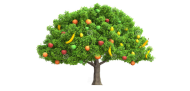

# Fruits-Tree
It's Binary Search Tree (BST). The nodes of the tree are of an abstract type named Fruit.

## Methods:
* Iterate();  a method that prints the in-order traversal of the tree.
* filterByType(Type): a method that prints the nodes of a given fruit type ordered by. weight. For example, get an ordered list of all apples in the tree
* filterByWeight(Weight): a method that prints the nodes that have weight larger than the given amount ordered by wright. For example, get an ordered list of all fruits in the tree that are heavier than 500 grams.
* magnifyByType(Type, Weight): a method that increases the weight of the nodes of a given fruit type by the given amount. For example, add 200 grams to all bananas in the tree.
* findHeaviest():  a method that finds the node with the greatest weight in the tree. 
* findLightest():  a method that finds the node with the least weight in the tree.

## License
[MIT](https://choosealicense.com/licenses/mit/)
